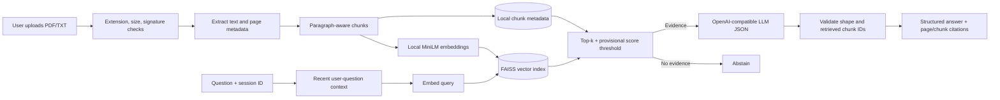
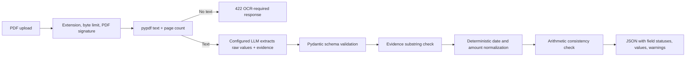
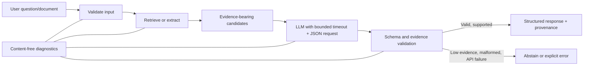

# Application architecture diagrams

## Problem 1: Document RAG

```mermaid
flowchart LR
  U[User uploads PDF/TXT] --> V[Extension, size, signature checks]
  V --> P[Extract text and page metadata]
  P --> C[Paragraph-aware chunks]
  C --> E[Local MiniLM embeddings]
  E --> F[(FAISS vector index)]
  C --> M[(Local chunk metadata)]
  Q[Question + session ID] --> H[Recent user-question context]
  H --> QE[Embed query]
  QE --> F
  F --> R[Top-k + provisional score threshold]
  R -->|No evidence| A[Abstain]
  R -->|Evidence| G[OpenAI-compatible LLM JSON]
  G --> J[Validate shape and retrieved chunk IDs]
  J --> S[Structured answer + page/chunk citations]
  M --> R
```

## Problem 5: Structured invoice extraction

```mermaid
flowchart LR
  U[PDF upload] --> V[Extension, byte limit, PDF signature]
  V --> P[pypdf text + page count]
  P -->|No text| O[422 OCR-required response]
  P -->|Text| L[Configured LLM extracts raw values + evidence]
  L --> S[Pydantic schema validation]
  S --> E[Evidence substring check]
  E --> N[Deterministic date and amount normalization]
  N --> D[Arithmetic consistency check]
  D --> R[JSON with field statuses, values, warnings]
```

## Common reliability workflow

```mermaid
flowchart LR
  I[User question/document] --> X[Validate input]
  X --> RET[Retrieve or extract]
  RET --> EV[Evidence-bearing candidates]
  EV --> LLM[LLM with bounded timeout + JSON request]
  LLM --> SH[Schema and evidence validation]
  SH -->|Valid, supported| OK[Structured response + provenance]
  SH -->|Low evidence, malformed, API failure| SAFE[Abstain or explicit error]
  LOG[Content-free diagnostics] --- X
  LOG --- RET
  LOG --- LLM
  LOG --- SH
```
